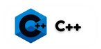

## Hi there, I'm [Anthony](https://github.com/anthonyraf) 👋

### ℹ About Me 
I'm currently a high school student in 11th grade, I am passionate about programming and I particularly like [Python](https://python.org). I am interested in software development. I also use other languages such as [Rust](https://www.rust-lang.org/) and [C++](http://www.cplusplus.org/).

<!--  -->

> **Note**
> Remember to star or fork the repository if you liked it 🔥

### 🧰 Languages and Tools:	

<!--

&nbsp;
&nbsp;
&nbsp;
-->

  
  
  
  
  
  
  
  

### 📊 Some stats

<b>👇 Global stats</b>  

 &nbsp; 

<b>👇 Contributions Graph</b>

<!-- 
-->
